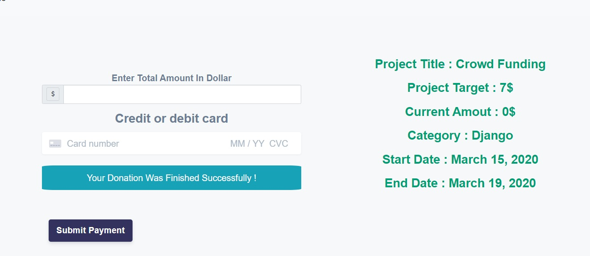

# Django-Crowd-Funding-Project [ KickStarter ]
### This Project about Crowd Funding Web Application System

### -Project Dependencies
<pre>
1-Python Django Framework
2-Django Templates
3-MySql Database
4-Jquery Ajax
5-HTML
6-Bootstrap
7-CSS
8-REST APIS
</pre>

### -Project Functionality & Requirements

1-Projects
<pre>
- The user can create a project fund raise campaign
- Users can view any project and donate to the total target ( Using Stripe Api )
- Users can add comments on the projects
- Comments can have replies
- Users can report inappropriate projects
- Users can report inappropriate comments
- Users can rate the projects
- Project creator can cancel the project if the donations are less than
25% of the target
- Project page should show the overall average rating of the project
- Project page should show the project pictures in a slider
- Project page should show 4 other similar projects based on project
tags
</pre>

### -Project Images

